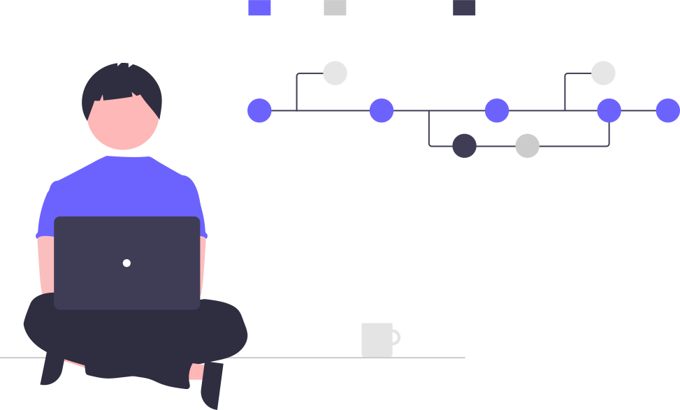

### Hi there. 👋🇮🇳

#
<!--  -->

👨‍💻 I'm a masters student at **<a href="https://www.kaist.ac.kr/en/"><b>Korea Advanced Institute of Science and Technology</b></a>** in <a href="http://vil.kaist.ac.kr/">Vehicular Intelligence Lab.</a> Previously a software engineer at <a href="http://www.slworld.com/Global/"><b>SL Lumax and SL Corporation</b></a>. *🚲 I love cycling*.

  

<!-- ## About Me
👨‍💻 I am a Computer Vision / AI Research Engineer at Neubility, specializing in developing perception algorithms for self-driving robots. I have a deep understanding of multiview geometry and a passion for training deep neural networks and optimizing them to make them lightweight.

🎓 I pursued my M.S. in Future Vehicle Program at <a href="https://www.kaist.ac.kr/en/"><b>KAIST</b></a>, where I worked as a Graduate Student Researcher in the Vehicular Intelligence Lab. My research interests include deep learning, 3D computer vision, and autonomous driving. I have also gained industry experience as an Automotive Software Engineer at <a href="http://www.slworld.com/Global/"><b>SL Lumax \& SL Corporation</b></a>.

🚲 In my free time, I love cycling and exploring the outdoors.  -->

### Programming Skills

 

### Frameworks

### Tools

My research interests include deep learning, 3D computer vision and autonomous driving.

#### 🌲 I’m currently working on...
- **Visual localization & Pose Estimation**

#### 🌱 Planning to work on...
- **Generative adverserial networks**
- **Multi-Object Tracking**

 
   

  <h3 align="center"></h3> 

<a href="https://www.linkedin.com/in/praveenkumar-rajendran/" target="blank">
 &nbsp; &nbsp;
</a>
 
 
  <a href="https://www.kaggle.com/praveenkumarr007" target="blank">
   &nbsp; &nbsp;
 </a>
   
   
 

